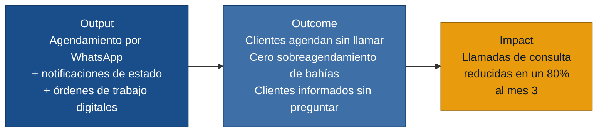

# MVP Canvas — tallermecanico

> Generado el 2026-06-18 · Fuentes: `personas.md`, `requisitos.md`, `evidence-map.json`

---

## Cadena de valor: output → outcome → impact

---

## Canvas

| Bloque | Contenido |
|---|---|
| **Propuesta de valor** | Reemplazar el control manual y en Excel por un sistema digital que permite a los clientes agendar citas por WhatsApp, impide el sobreagendamiento de bahías y envía notificaciones automáticas sobre el estado del vehículo, liberando al asesor de servicio de constantes llamadas de consulta y optimizando el flujo de trabajo del mecánico. |
| **Segmento de usuarios** | Clientes que buscan agendar mantenimientos de forma rápida y sin esperas telefónicas (`paciente.md`); asesor de servicio que gestiona la agenda y absorbe la carga operativa de actualizar a los clientes (`recepcionista.md`); jefe de taller/mecánico que necesita organizar sus órdenes de trabajo diarias sin fricciones (`doctora.md`). |
| **Funcionalidades mínimas** | 1. Agendamiento online vía WhatsApp con selección de fecha/hora y confirmación. *(R-01)* · 2. Validación de disponibilidad de bahías en tiempo real: cero sobreagendamientos. *(R-02)* · 3. Notificación automática por WhatsApp indicando cambios en el estado del vehículo (en revisión, reparando, listo). *(R-03)* · 4. Vista de órdenes de trabajo diarias para el mecánico, accesible desde móvil/tablet. *(R-04)* · 5. Bloqueo de bahías por mantenimiento de equipos o ausencias del personal. |
| **Resultado esperado (outcome)** | Los clientes agendan su mantenimiento sin necesidad de llamar. El asesor de servicio deja de invertir horas contestando llamadas para informar "si el auto ya está listo". El solapamiento de vehículos en una misma bahía deja de ocurrir, permitiendo al taller operar a capacidad óptima. |
| **Métrica de éxito** | Reducción del volumen de llamadas entrantes consultando el estado del vehículo en un 80% al tercer mes de operación. Prueba ácida: si el asesor recupera estas horas, puede dedicarlas a la recepción proactiva y al upselling de servicios, aumentando el ticket promedio del taller. |
| **Riesgos / supuestos** | 1. Los clientes del taller prefieren usar WhatsApp antes que llamar (respaldado en `cliente.md`). · 2. El asesor de servicio abandona el registro manual desde el día 1, evitando flujos paralelos. · 3. Los mecánicos actualizarán el estado del vehículo en el sistema en tiempo real. · 4. El costo de la integración/API de WhatsApp es asumible por el taller. |
| **Fuera de alcance (por ahora)** | Generación de cotizaciones complejas o presupuestos detallados al momento de agendar. Gestión de múltiples sucursales del taller. Integración con el sistema contable o ERP para facturación. Pasarelas de pago o cobro anticipado en línea. Panel de métricas financieras para el dueño del taller *(no hay evidencia primaria de este rol para el MVP)*. |

---

## Notas de priorización

El núcleo del MVP (US-01 a US-05) ataca los tres dolores que aparecen en todas las personas:

- **Barrera telefónica** → US-01 (agendamiento WhatsApp) resuelve el dolor de C. y descarga la línea de A.
- **Dobles reservas** → US-02 (validación en tiempo real) elimina el caos operativo en el piso del taller.
- **No-shows e inasistencias** → US-03 (recordatorio automático) libera a A. de la carga operativa y mantiene tranquilo a C.

US-04 y US-05 son el lado de la oferta: sin ellas, Carlos (el mecánico) no puede organizar su trabajo ni actualizar el estado del vehículo, lo que rompería la cadena de valor de las notificaciones hacia el cliente.
