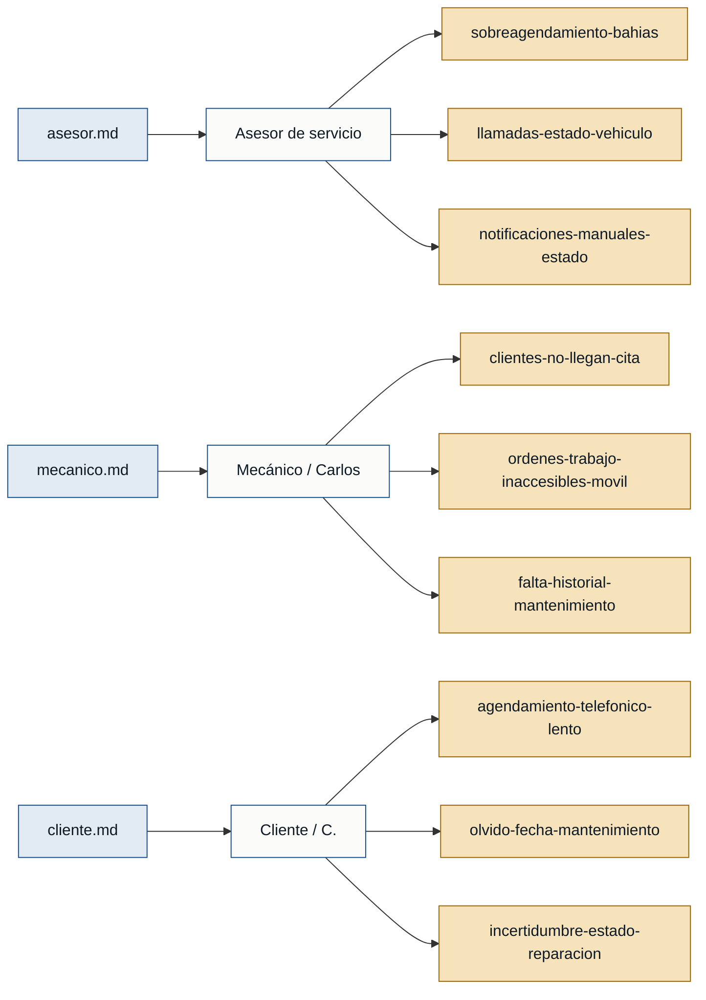

# Personas y Stakeholders — tallermecanico

> Generado el 2026-07-04 · Fuentes: `asesor.md`, `mecanico.md`, `cliente.md`

---

## Personas

### A. (asesor de servicio) — Recepción del taller
- **Contexto:** Administra la agenda de reparaciones y mantenimientos de forma manual (cuaderno + Excel) y es el principal punto de contacto para los clientes.
- **Objetivo principal:** Gestionar el ingreso de vehículos sin saturar la capacidad operativa del taller y mantener a los clientes informados sin demoras.
- **Dolores:**
  - Sobreagendamiento de bahías de trabajo por desincronización entre el cuaderno y el Excel, causando cuellos de botella. *(asesor.md)*
  - Gran volumen de llamadas diarias de clientes preguntando "¿ya está listo mi auto?", lo que interrumpe la recepción de nuevos vehículos. *(asesor.md)*
  - Actualizar el estado de reparación cliente por cliente de forma manual toma demasiado tiempo operativo. *(asesor.md)*
- **Respaldo:** `primera mano` *(asesor.md)*

---

### Carlos — Jefe de taller / mecánico
- **Contexto:** Mecánico principal que distribuye el trabajo en las bahías y ejecuta las reparaciones; depende de la agenda que arma el asesor de servicio.
- **Objetivo principal:** Aprovechar al máximo el tiempo de las bahías sin huecos imprevistos y tener visibilidad clara de las órdenes del día.
- **Dolores:**
  - Clientes que agendan y no se presentan, dejando bahías de trabajo y personal inactivos por periodos de 1 a 2 horas. *(mecanico.md)*
  - No puede ver las órdenes de trabajo programadas desde su celular mientras está en el piso de operaciones; depende de ir a la oficina. *(mecanico.md)*
  - Los vehículos nuevos llegan sin un historial claro de fallas previas, perdiendo tiempo valioso en el diagnóstico inicial. *(mecanico.md)*
- **Respaldo:** `primera mano` *(mecanico.md)*

---

### C. — Cliente del taller
- **Contexto:** Profesional de 45 años que depende de su vehículo para trabajar; necesita mantenimientos rápidos y eficientes.
- **Objetivo principal:** Agendar mantenimientos sin fricciones y saber exactamente cuándo retirar su vehículo sin perder tiempo.
- **Dolores:**
  - El proceso de agendamiento telefónico es lento y la línea suele estar ocupada cuando intenta coordinar una revisión. *(cliente.md)*
  - Olvida las fechas estimadas para sus próximos mantenimientos preventivos (cambios de aceite, frenos). *(cliente.md)*
  - Incertidumbre sobre el estado de su vehículo en el taller; no sabe si ya lo están reparando o si está listo para recoger. *(cliente.md)*
- **Respaldo:** `primera mano` *(cliente.md)*

---

## Stakeholders

### Dueño del taller
- **Interés en el sistema:** Revisa los números del negocio (rotación de bahías, ingresos diarios); tiene interés en reducir los tiempos muertos y mejorar la satisfacción del cliente para asegurar el retorno.
- **Fuente:** *(asesor.md)* — mencionado por A.: "El dueño revisa cuántos autos salieron al final del día, pero él no atiende a los clientes directamente."

> ⚠️ El dueño del taller aparece solo **referenciado**; no existe entrevista de primera mano de ese rol. No puede respaldar personas ni requisitos por sí mismo.

---

## Mapa de trazabilidad

