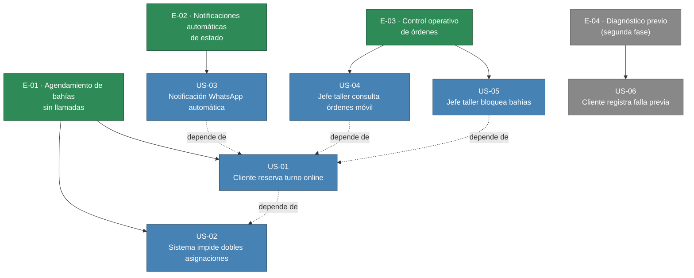

# Épicas — Taller Mecánico MVP

> Generado 2026-07-04 · Trazado a: mvp-canvas.md, user-stories.json, requisitos.md, personas.md, evidence-map.json

---

## E-01 · Agendamiento de bahías sin llamadas

**Valor (outcome):** Los clientes reservan un turno de bahía en cualquier momento del día sin depender de la atención telefónica. Las sobreasignaciones de bahías se eliminan por completo. El asesor de servicio deja de recibir llamadas constantes para verificar disponibilidad.

**Personas beneficiadas:** C. (cliente) · A. (asesor de servicio)

**Dolores que ataca:** `agenda-telefonica-caotica`, `sobreagendamiento-bahias`, `llamadas-coordinacion-agenda`

**Origen:** mvp-canvas.md F1, F2 · user-stories.json US-01, US-02 · requisitos.md R-01, R-02, R-06 · evidence-map.json pains[asesor.md, cliente.md]

**Prioridad:** 1 — Es el cuello de botella principal del MVP; sin agendamiento de bahías online el resto del sistema no tiene base operativa. Ataca el dolor más crítico del asesor y el cliente.

**Historias:** US-01, US-02

---

## E-02 · Notificaciones automáticas de estado

**Valor (outcome):** Reducción de llamadas de "¿Cómo va mi carro?" en un 50% al tercer mes. El cliente recibe proactivamente el estado de su vehículo (revisión, listo, etc.). El asesor recupera tiempo operativo al no tener que gestionar actualizaciones manuales.

**Personas beneficiadas:** C. (cliente) · A. (asesor de servicio) · Carlos (jefe de taller)

**Dolores que ataca:** `llamadas-estado-vehiculo`, `incertidumbre-cliente-falta-info`

**Origen:** mvp-canvas.md F3 · user-stories.json US-03 · requisitos.md R-03 · evidence-map.json pains[asesor.md, cliente.md]

**Prioridad:** 2 — Impacta directamente la satisfacción del cliente y la carga operativa del asesor. Es transversal a todas las personas. Depende de E-01 (necesita el registro de la cita/orden).

**Historias:** US-03

---

## E-03 · Control operativo de órdenes y bahías

**Valor (outcome):** El jefe de taller consulta el estado de las órdenes desde el celular en el piso de operaciones, sin tener que ir a la oficina a preguntar al asesor. Puede bloquear bahías por mantenimiento, evitando conflictos de último momento.

**Personas beneficiadas:** Carlos (jefe de taller) · A. (asesor de servicio)

**Dolores que ataca:** `ordenes-en-papel-perdidas`, `desincronizacion-bahias`

**Origen:** mvp-canvas.md F4, F5 · user-stories.json US-04, US-05 · requisitos.md R-04, R-07, R-08 · evidence-map.json pains[mecanico.md, asesor.md]

**Prioridad:** 3 — Lado de la oferta: sin visibilidad móvil, el jefe de taller opera a ciegas respecto a los cambios de disponibilidad del asesor. Depende de E-01 para tener datos de órdenes y bahías.

**Historias:** US-04, US-05

---

## Candidatos de segunda fase (fuera del MVP)

### E-04 · Diagnóstico previo de la falla

**Valor (outcome):** El taller conoce la falla reportada antes de recibir el vehículo, optimizando la asignación de repuestos y personal técnico.

**Dolores que ataca:** `falta-info-falla-previa`

**Origen:** mvp-canvas.md (fuera de alcance explícito) · user-stories.json US-06 · requisitos.md R-05

**Prioridad:** 4 — Fuera del MVP por decisión de mantener el alcance limitado. No hay evidencia de que esto bloquee la operatividad básica.

**Historias:** US-06

---

## Diagrama Mermaid del backlog

