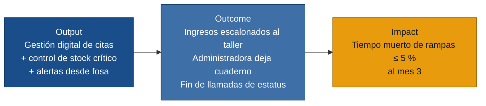
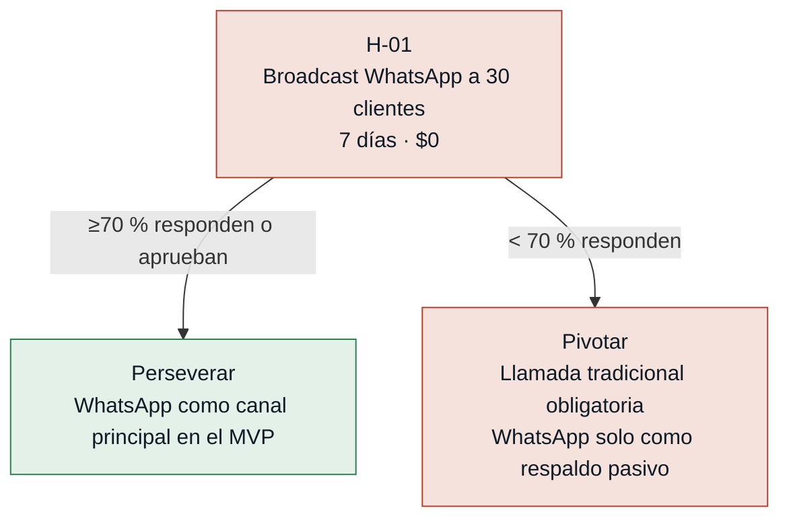
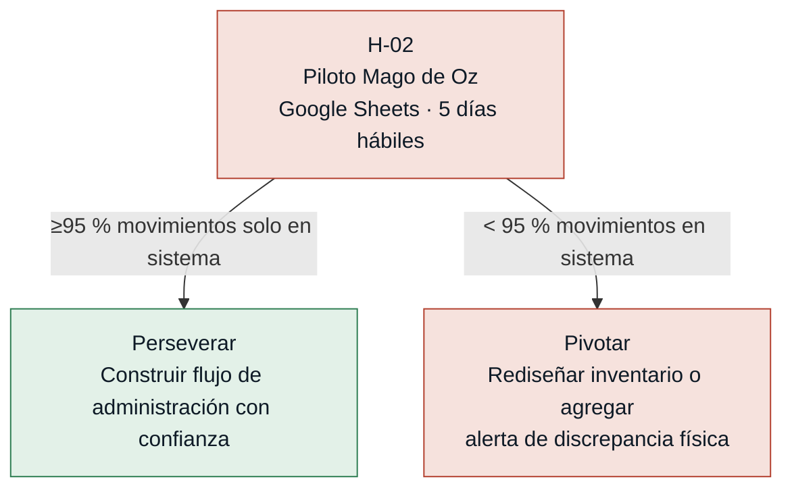
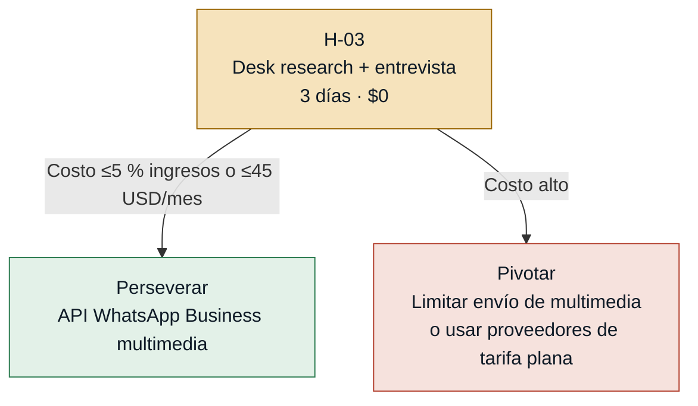
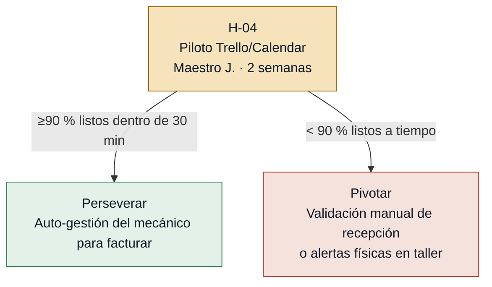
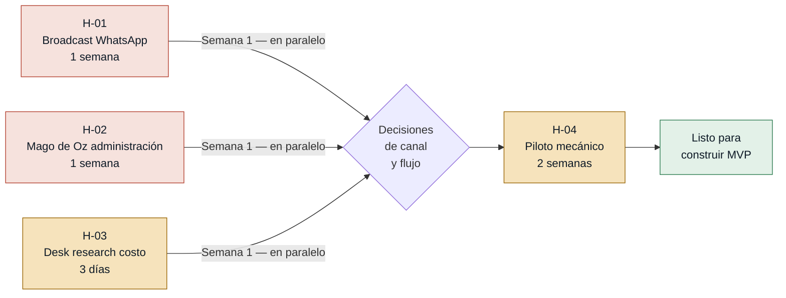

# Hipótesis y Experimentos — citamecanico

> Generado el 2026-06-18 · Fuentes: `mvp-canvas.md`, `requisitos.md`, `evidence-map.json`

---

## Cadena output → outcome → impact

Las hipótesis abajo son los **puentes** entre el output (lo que construimos) y el outcome (el comportamiento que debe cambiar). Si un supuesto falla, la cadena se corta antes de producir impacto.

---

## Orden de prioridad por riesgo

| # | Hipótesis | Riesgo | Experimento | Caja de tiempo |
|---|---|---|---|---|
| H-01 | Clientes aprueban presupuestos por WhatsApp activamente | 🔴 Alto | Broadcast + entrevistas | 1 semana · $0 |
| H-02 | Administradora abandona cuaderno desde el día 1 | 🔴 Alto | Piloto Mago de Oz · Google Sheets | 1 semana · $0 |
| H-03 | Costo de API WhatsApp Business con multimedia es asumible | 🟡 Medio | Desk research + entrevista de volumen | 3 días · $0 |
| H-04 | Mecánico marca fin de trabajos desde el taller a tiempo | 🟡 Medio | Piloto Google Calendar · 2 semanas | 2 semanas · $0 |

---

### [H-01] Adopción de WhatsApp por la base de pacientes — riesgo: alto

- **Supuesto a probar:** La mayoría de los clientes actuales del taller tiene WhatsApp activo y lo usa habitualmente, de modo que el envío de cotizaciones, fotos y estados de reparación por ese canal serán efectivos.
- **Hipótesis:** Creemos que ≥70 % de los clientes interactuará con las actualizaciones y aprobará presupuestos por WhatsApp si les enviamos el estado de su reparación por ahí, porque Diego M. en `cliente.md` lo prefiere pero representa solo una parte de la base total de clientes.
- **Señal medible:** Tasa de respuesta o aprobación de presupuestos de los clientes ante un mensaje de WhatsApp de prueba dentro de las primeras 4 horas.
- **Criterio de éxito:** ≥70 % de los 30 clientes contactados responde o aprueba el presupuesto por mensaje dentro de las 4 horas del envío.
- **Experimento:** Broadcast de WhatsApp + entrevistas dirigidas. Enviar reportes de avance y fotos del estado de las piezas a una muestra de 30 clientes (con su consentimiento), usando el WhatsApp personal de la administradora; medir tasa de respuesta. Complementar con 5 entrevistas cortas a clientes de distintos perfiles para identificar barreras en la recepción de reportes técnicos digitales.
- **Caja de tiempo/costo:** 1 semana · costo $0 (WhatsApp personal de la administradora; sin API de pago).
- **Regla de decisión:** Si pasa (≥70 % responden) → usar WhatsApp como canal principal de comunicación y aprobación en el MVP. Si falla (<70 %) → evaluar canal alternativo (llamadas telefónicas tradicionales) o flujo mixto antes de automatizar el canal.

---

### [H-02] Abandono completo del cuaderno y Excel por la recepcionista — riesgo: alto

- **Supuesto a probar:** La administradora Sra. Elena dejará de usar el cuaderno de notas desde el primer día de adopción del sistema digital para el inventario y las citas, sin uso paralelo que genere descontrol de stock.
- **Hipótesis:** Creemos que la Sra. Elena registrará ≥95 % de las órdenes de trabajo y movimientos de stock exclusivamente en el sistema digital si se le provee de un flujo simple en su computadora, porque cualquier registro paralelo en papel neutralizaría la capacidad del sistema de prevenir el descontrol de repuestos — el dolor central que el MVP promete eliminar.
- **Señal medible:** Porcentaje de órdenes de trabajo y movimientos de repuestos registrados únicamente en el sistema digital durante los primeros 5 días hábiles de operación (sin anotaciones paralelas en su cuaderno).
- **Criterio de éxito:** ≥95 % de los movimientos en los primeros 5 días hábiles se registran solo en el sistema digital.
- **Experimento:** Piloto Mago de Oz de 1 semana: reemplazar el cuaderno de inventario y citas con una planilla de Google Sheets compartida en tiempo real (que simula el sistema sin construirlo). Al final de los 5 días, auditar cuántas órdenes pasaron solo por la hoja vs. cuántas aparecieron también en papel.
- **Caja de tiempo/costo:** 1 semana · costo $0 (Google Sheets gratuito; 2-3 h de preparación de la hoja).
- **Regla de decisión:** Si pasa (≥95 % en sistema) → construir el flujo de administración con confianza en la adopción. Si falla (<95 %) → identificar la fricción que la devuelve al cuaderno (lentitud al buscar piezas, falta de costumbre, agilidad del papel) y rediseñar el flujo o agregar una alerta de inconsistencia antes de programar de forma definitiva.

---

### [H-03] Costo de la API de WhatsApp Business asumible por el taller — riesgo: medio

- **Supuesto a probar:** El costo mensual de la API de WhatsApp Business (Meta) para el volumen de notificaciones, cotizaciones y fotos del taller es asumible para un negocio automotriz pequeño/mediano.
- **Hipótesis:** Creemos que el costo mensual de la API de WhatsApp Business será ≤5 % de los ingresos mensuales del taller si calculamos el gasto basado en el volumen real de carros atendidos, porque el precio de Meta es por conversación iniciada y un taller maneja un volumen acotado pero de alto ticket por cliente.
- **Señal medible:** Costo mensual proyectado de la API de WhatsApp Business expresado como porcentaje de los ingresos mensuales estimados del taller.
- **Criterio de éxito:** El costo mensual calculado es ≤5 % de los ingresos mensuales del taller O ≤45 USD/mes, evaluado antes de comprometer la arquitectura de notificaciones.
- **Experimento:** Desk research + entrevista de 20 min con la administradora para obtener el volumen de carros mensual y el ingreso promedio por reparación. Calcular el costo usando la tabla de precios publicada por Meta para LatAm, considerando el envío de archivos multimedia (fotos de repuestos dañados). Comparar con alternativas de mercado o SMS.
- **Caja de tiempo/costo:** 2-3 días · costo $0 (desk research; entrevista interna).
- **Regla de decisión:**Si pasa (≤5 % ingresos o ≤45 USD/mes) → comprometer la arquitectura al canal WhatsApp Business. Si falla (costo alto por el peso de imágenes/videos) → evaluar proveedores externos con planes planos o limitar el uso de multimedia a casos de reparaciones críticas.

---

### [H-04] El mecánico registra el fin de los trabajos a tiempo — riesgo: medio

- **Supuesto a probar:** El Maestro J. definirá los tiempos estimados de reparación y marcará el fin de los trabajos de forma consistente desde el taller sin requerir la intervención o supervisión física de la administradora.
- **Hipótesis:** Creemos que el Maestro J. registrará el estado "trabajo terminado" dentro de los 30 min de finalizar la reparación si dispone de una interfaz de 2 pasos o menos en un dispositivo móvil en el taller, porque `mecanico.md` muestra que organizar las rampas es su dolor principal.
- **Señal medible:** Porcentaje de trabajos marcados como listos dentro de los 30 min de su finalización real, sobre el total de reparaciones en el piloto de 2 semanas.
- **Criterio de éxito:** ≥90 % de las reparaciones terminadas durante el piloto de 2 semanas se notifican en el sistema digital dentro de los 30 min de liberar la rampa.
- **Experimento:** Piloto Mago de Oz de 2 semanas: entregar al mecánico un tablero simple en Google Calendar o Trello compartido con la recepción; pedirle que mueva la tarjeta del carro a 'Listo' usando una tablet o celular en el taller. Medir el tiempo de desfase vs. la hora de entrega real del carro.
- **Caja de tiempo/costo:** 2 semanas · costo $0 (Trello o Google Calendar gratuitos).
- **Regla de decisión:** Si pasa (≥90 % a tiempo) → confiar en el modelo de auto-gestión del mecánico para generar la facturación automática. Si falla (<90 %) → mantener el flujo donde la administradora confirma manualmente el estado de la rampa, o implementar un sistema de alertas físicas en el taller en lugar de esperar la acción del mecánico.

---

## Secuencia de aprendizaje recomendada

H-01, H-02 y H-03 corren en paralelo durante la primera semana (costo total $0). H-04 empieza en la semana siguiente y puede solapar con el inicio de construcción de lo ya validado.
