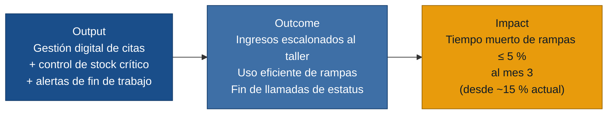

# MVP Canvas — citamecanico

> Generado el 2026-06-18 · Fuentes: `personas.md`, `requisitos.md`, `evidence-map.json`

---

## Cadena de valor: output → outcome → impact

---

## Canvas

| Bloque | Contenido |
|---|---|
| **Propuesta de valor** | Reemplazar el cuaderno y el Excel por un sistema digital de gestión de taller que permite coordinar las citas de ingreso para evitar la saturación matutina, rastrear el inventario de repuestos en tiempo real para eliminar los autos clavados en rampa por falta de piezas, y notificar de forma automática el estatus del trabajo a administración, liberando tiempo de supervisión manual. |
| **Segmento de usuarios** | Mecánico principal que pierde productividad con autos varados en rampa por falta de piezas (`mecanico.md`); administradora que sufre el descontrol de inventario y la saturación de ingresos matutinos sin cita (`recepcionista.md`); cliente que exige transparencia en tiempos de entrega y repuestos (`cliente.md`). |
| **Funcionalidades mínimas** | 1. Registro y escalonamiento digital de citas de ingreso por franjas horarias. *(R-01, R-06)* · 2. Control básico de stock de repuestos críticos con alerta de disponibilidad antes de desarmar. *(R-02)* · 3. Interfaz móvil simplificada para que el mecánico marque "trabajo terminado" en 2 pasos desde la fosa. *(R-03)* · 4. Generación automática de pre-orden de facturación al concluir la reparación. *(R-04)* · 5. Envío manual/semiautomatizado de reportes de avance y fotos del estado de piezas al cliente por WhatsApp. *(R-07)* |
| **Resultado esperado (outcome)** | Los carros ingresan de forma ordenada a lo largo del día. El mecánico sabe si hay repuestos disponibles antes de subir un carro a la rampa, evitando bloquear el espacio. La administradora deja de ir a la fosa a preguntar si un carro está listo; genera la orden de cobro de inmediato y el cliente recibe notificaciones claras de su entrega. |
| **Métrica de éxito** | Reducción del tiempo muerto de rampas por autos clavados a ≤ 5 % al tercer mes de operación, frente al ~15 % reportado en `mecanico.md`. Prueba ácida: al reducir este cuello de botella, el taller libera ≈ 4 horas operativas por rampa a la semana, permitiendo ingresar al menos un flujo adicional de ABC de motor o frenos — impacto directo en la facturación. Si al mes 3 sigue sobre el 10 %, el taller debe evaluar un módulo de compras automatizado con proveedores locales. |
| **Riesgos / supuestos** | 1. Los clientes responden positivamente a las cotizaciones y evidencias visuales por WhatsApp (respaldado por Diego M. en `cliente.md`). · 2. La administradora abandona por completo el cuaderno y actualiza el stock digital desde el día 1 para evitar discrepancias. · 3. El costo operativo de la API de WhatsApp para el envío de multimedia es viable con el ticket promedio del taller. · 4. El mecánico mantiene la disciplina de marcar el fin de los trabajos en el dispositivo del taller. |
| **Fuera de alcance (por ahora)** | Historial clínico/mantenimiento detallado de carros nuevos *(US-06 — segunda fase; añade valor pero no es el cuello de botella principal)*. Integración automatizada con APIs de múltiples proveedores de repuestos externos. Pasarela de pagos en línea para el cobro del arreglo. Panel avanzado de analítica de rendimiento por mecánico *(no hay entrevista de primera mano de ese rol; construir para él sin evidencia directa violaría la regla de cero invención)*. |

---

## Notas de priorización

El núcleo del MVP (US-01 a US-05) ataca los tres dolores que aparecen en todas las personas:

- **Saturación en recepción** → US-01 (agendamiento online) El escalonamiento de citas elimina los cuellos de botella matutinos que estresan el taller.
- **Autos clavados** → US-02 (validación en tiempo real) El control de stock crítico asegura que no se desarme un motor si no se cuenta con las piezas necesarias en la bodega.
- **Seguimiento manual e ineficiente** → US-03 (recordatorio automático) La actualización del estado desde la fosa por el mecánico automatiza el aviso de facturación a la administradora sin necesidad de rondas físicas de supervisión.
US-04 y US-05 son el lado de la oferta: sin ellas la médico no puede controlar su propia agenda, lo que hace inútil el sistema de cara a ella.
