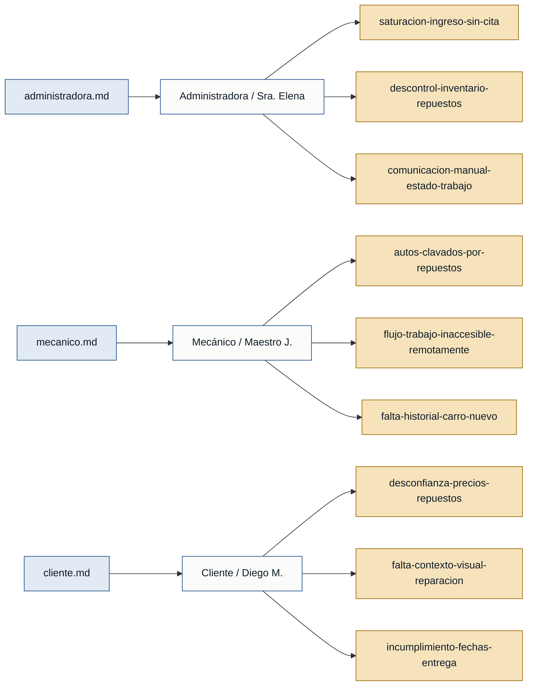

# Personas y Stakeholders — citamecanico

> Generado el 2026-06-18 · Fuentes: `recepcionista.md`, `mecanico.md`, `cliente.md`

---

## Personas

### Sra. Elena (administradora) — Recepción y administración del taller
- **Contexto:** Controla las citas de ingreso de vehículos, el inventario de repuestos mediante un cuaderno y hojas de cálculo que no siempre están actualizadas, y la facturación al cierre del servicio.
- **Objetivo principal:** Organizar la entrada de vehículos de forma escalonada para evitar la saturación del taller y gestionar el inventario con precisión para asegurar la disponibilidad de repuestos antes de empezar una labor.
- **Dolores:**
  - Los clientes llegan todos a la misma hora por la mañana sin cita previa, lo que satura el taller al inicio del día y lo deja vacío por la tarde. *(recepcionista.md)*
  - El control manual genera desajustes en el stock, provocando que se asegure la existencia de piezas (como pastillas de freno) que ya se consumieron. *(recepcionista.md)*
  - Pérdida de tiempo valioso yendo físicamente a la fosa a confirmar si el mecánico terminó un carro para poder generar la pre-orden y llamar al cliente. *(recepcionista.md)*
- **Respaldo:** `primera mano` *(recepcionista.md)*

---

### Maestro J. — Mecánico (diagnóstico y motores)
- **Contexto:** Mecánico principal que coordina el uso de las rampas del taller, diagnostica fallas complejas y ejecuta las reparaciones mayores de motores y transmisiones.
- **Objetivo principal:** Maximizar el tiempo productivo de las rampas de trabajo eliminando demoras logísticas ajenas a la reparación técnica.
- **Dolores:**
  - Pérdida de productividad por autos clavados ocupando rampas durante días debido a la falta de un repuesto crítico por parte del proveedor. *(mecanico.md)*
  - Incapacidad de visualizar el flujo de ingresos o el orden de prioridades del día siguiente fuera del taller para preparar las herramientas. *(mecanico.md)*
  - Los vehículos nuevos ingresan sin ningún tipo de historial previo, obligándolo a gastar tiempo adivinando adaptaciones previas o mantenimientos pasados. *(mecanico.md)*
- **Respaldo:** `primera mano` *(mecancio.md)*

---

### Diego M. — Cliente (propietario del vehículo)
- **Contexto:** Propietario de un vehículo de uso diario; trabaja a tiempo completo en oficina y requiere programar las reparaciones del carro de manera estricta para no alterar su rutina de movilidad.
- **Objetivo principal:** Obtener transparencia total sobre los costos de los repuestos aplicados y recibir el vehículo exactamente en la fecha acordada.
- **Dolores:**
  - Desconfianza al dejar el automóvil debido a la falta de claridad en los precios o la adición de cargos por repuestos imprevistos sin evidencia de su necesidad. *(cliente.md)*
  - Su cita "no apareció" en el cuaderno al llegar, tuvo que esperar 2 horas sin haber pedido permiso previo para tanto tiempo. *(cliente.md)*
  - Los recordatorios son inconsistentes (a veces llaman, a veces no); prefiere WhatsApp porque lo revisa todo el día. *(cliente.md)*
- **Respaldo:** `primera mano` *(cliente.md)*

---

## Stakeholders

### Proveedor de repuestos
- **Interés en el sistema:** Proveedor de repuestos
- **Fuente:** *(mecanico.md)* — mencionado por el Maestro J.: "cuando desarmamos un motor y resulta que falta un repuesto que el cliente no trajo o el proveedor no tiene, el carro se queda ocupando una rampa."

> ⚠️ El proveedor de repuestos aparece solo referenciado; no existe una entrevista de primera mano para este rol. No puede respaldar de forma autónoma requisitos ni personas en el MVP.

---

## Mapa de trazabilidad

